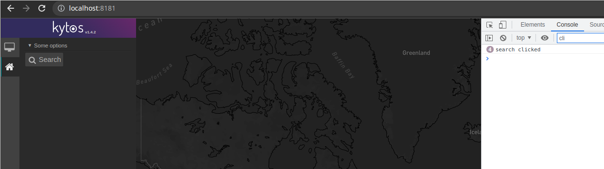

## sample_ui

Kytos `sample_ui` NApp that's a hello world to show how the `ui` folder should be structured.


## How to install

- Make sure `kytos` is installed

```
for repo in python-openflow kytos-utils kytos; do
  git clone https://github.com/kytos-ng/${repo}
done

for repo in python-openflow kytos-utils kytos; do
  cd ${repo}
  python3 setup.py develop
  cd ..
done
```

- Install this NApp:

```
git clone https://github.com/viniarck/sample_ui.git
cd sample_ui/
python setup.py develop
```

If you install it successfully, after running `python setup.py develop` you should see something similar to this output:

```
running develop
running egg_info
Installing dependencies...
You should consider upgrading via the '/tmp/kytos/.direnv/python-3.9.4/bin/python -m pip
creating kytos_sample_ui.egg-info
writing kytos_sample_ui.egg-info/PKG-INFO
writing dependency_links to kytos_sample_ui.egg-info/dependency_links.txt
writing requirements to kytos_sample_ui.egg-info/requires.txt
running build_ext
Creating /tmp/kytos/.direnv/python-3.9.4/lib/python3.9/site-packages/kytos-sample-ui.egg
Adding kytos-sample-ui 1.0.0 to easy-install.pth file
...
...
Finished processing dependencies for kytos-sample-ui==1.0.0
```

- Run kytos:

```
kytosd -f
```

- Enable the this NApp:

```
kytos napps enable kytos/sample_ui
```

- Restart kytos and run it again.

Notice that `sample_ui` was correctly loaded

```
2022-01-31 18:44:03,853 - INFO [kytos.core.controller] (MainThread) Loading NApp kytos/sample_ui
2022-01-31 18:44:03,892 - INFO [kytos.napps.kytos/sample_ui] (MainThread) sample_ui napp loaded
```

- Open this localhost URL on your browser:

http://localhost:8181/

Notice the `sample_ui` Napp is loaded:


